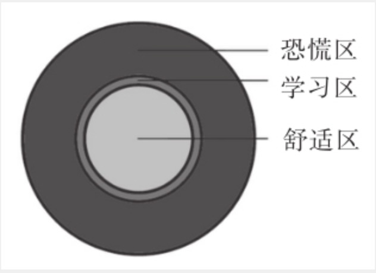

# 我们如何学习编程？

最近读了万维刚老师的《学习究竟是什么》，里面提到刻意练习，我发现编程很适合用刻意练习的方式来学习。借此说明一下我们群计划如何学习Python。

刻意练习的要点有4个：

1. 只在“学习区”练习；

2. 把要训练的内容分成有针对性的小块，对每一个小块进行重复练习；

3. 在整个练习过程中，随时能获得有效的反馈；

4. 练习时注意力必须高度集中；

   

## 1. 只在“学习区”练习
心理学家把人的知识和技能分为层层嵌套的三个圆形区域：

最内一层是“舒适区”，是我们已经熟练掌握的各种技能；

最外一层是“恐慌区”，是我们暂时无法学会的技能；

二者中间则是“学习区”，是最适合我们现在学习的技能。

精英日课专栏有个著名的公式

> 喜欢 = 熟悉 + 意外

只在舒适区学习，不会有进步，而且很快我们就会厌倦。借助人工智能领域的研究成果，科学家甚至计算出大脑最喜欢的陌生事物的比例是15.87%。也就是说，我们学习一项新内容时，如果有85%的内容是熟悉的，15%的内容是陌生的，这个时候的学习的效率最高。

回到Python编程学习，如果你对编程没有概念，我会推荐你从苹果公司开发的Swift Playground游戏开始，你可以查看我们的[项目](https://github.com/lanjing99/20HoursPython) , 找到Week01-Week04 Swift Playground相关的内容。玩这个游戏不需要编程知识。只要我们有一些生活常识就足够了，在玩的过程中，会不知不觉学会一些编程的概念，例如函数、条件判断、循环、算法、变量、对象、数组等等。预计10个小时可以通关 Swift Playgrounds 学习编程1，2。

在此之后，我们便正式进入Python语言的学习。编程是一门强调实践的学科，所以，我们会尽早开始写代码。为此，我会暂时舍弃复杂的集成开发环境工具的介绍，只用类似记事本和命令行就可以开始写代码，运行代码，1个小时内先写出第一行代码，也就是著名的"hello world."

## 2. 针对性的小块重复练习
我设计学习内容的”心法“有两个，也是我追求的目标：
1. 隐藏你当下还用不到的知识
    让学习曲线比较平缓，不至于卡在某个地方，一个知识点应该在它被应用到的前一刻提到它。
2. 一次只引入一个陌生的概念
   在引入新概念的时候，配套足够的练习。编程只知道概念甚至细节都不能保证写出来的代码没有问题，写出正确的代码才是目标。

具体的10周学习内容可以[20小时Python学习地图.md](https://github.com/lanjing99/20HoursPython/blob/master/20小时Python学习地图.md)，现在还在迭代中。

在掌握基本概念之后，我们用一个解决现实问题的项目来串起所有的知识，在项目中学习的方式是最快的。

## 3. 有效的反馈
与学习其它内容相比，学编程最大的一个福利是，电脑可以给你几乎实时的反馈，无论你代码写对了还是写错了，都可以从程序运行的结果中得到答案。不要错过这个福利，多写代码。

在你遇到问题的时候，针对你的问题给予反馈，是我们群里的几位程序员能提供的最大价值。所以，我们不适合像大学老师一样在讲台上给你讲每一个编程知识点，这样效果不好也要耗费太多精力。如果你之前很少尝试过自学一个领域的知识，现在正是好机会。

但是我们程序员的问题在于“知识的诅咒”，因为已经过了编程入门期，可能完全预料不到你可能会在我们觉得是常识的地方遇到困难。所以，有问题，请反馈给我们。

计划每周用腾讯会议安排一次的线上聊天，暂时先定在每周四21：00-21：40，大家一起聊一聊这周遇到了哪些问题，有什么可以改进的地方。

## 4. 练习时高度集中
每周专心两个小时，这两个小时不刷手机、不看网页等。学习任何一个新技能似乎都不容易。但凡是值得一做的事情，似乎都不容易，想想得到大学的选题分享和毕业设计：），这可以当做毕业设计的延续。蔡钰老师建议的毕业设计一个方向就是小组一起学习编程。

**欢迎你的加入！开始编程之旅！**

## 欢迎提bug

欢迎你给我们反馈，提bug（指出错误或者提出改进建议）到[这里](https://github.com/lanjing99/20HoursPython/issues/2) 。

不冒犯你的话，我为每个bug支付2.56元的红包略表谢意。